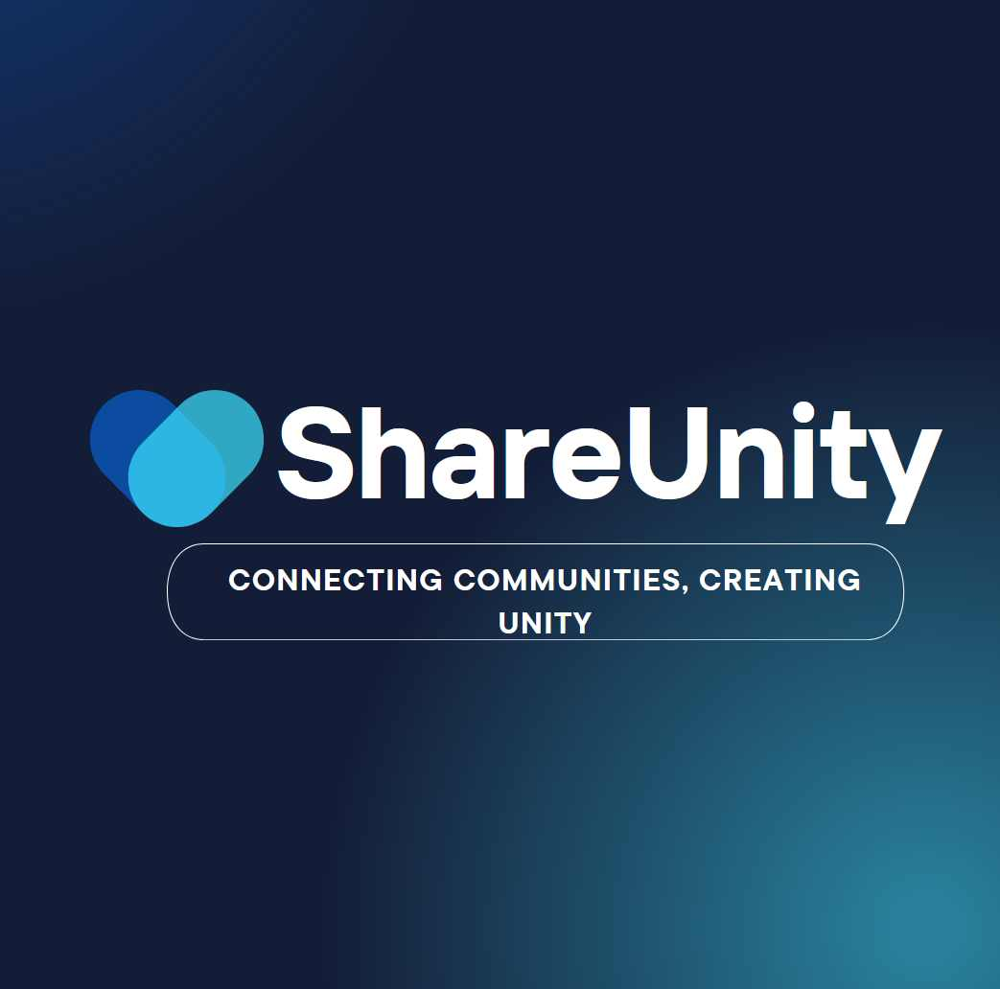

<h1>ShareUnity_Project </h1>

<div align="left">
  
  <p><strong>The aim of the project is to create a website that allows users to run their thematic blog, add posts, and share their passion with a wide audience. The project is intended to create an attractive website encouraging new authors to join the community. In the face of ubiquitous information overload, especially in the form of dynamic videos and other virtual content, there is a space for written content that offers different experiences and deeper analysis.</strong></p>
</div>

[](https://www.repostatus.org/#wip)
[](#license)

# Preparing the environment

Activate virtual env and install requirements.txt script:

`source init_environment.sh`

## Alternative:

```sh
virtualenv venv -p python3
source venv/bin/activate  # for Unix/Linux
venv\Scripts\Activate     # for Windows

pip install -r requirements.txt  # for dependecies
```

## Deactivating env
Just type:
```sh
deactivate
```

